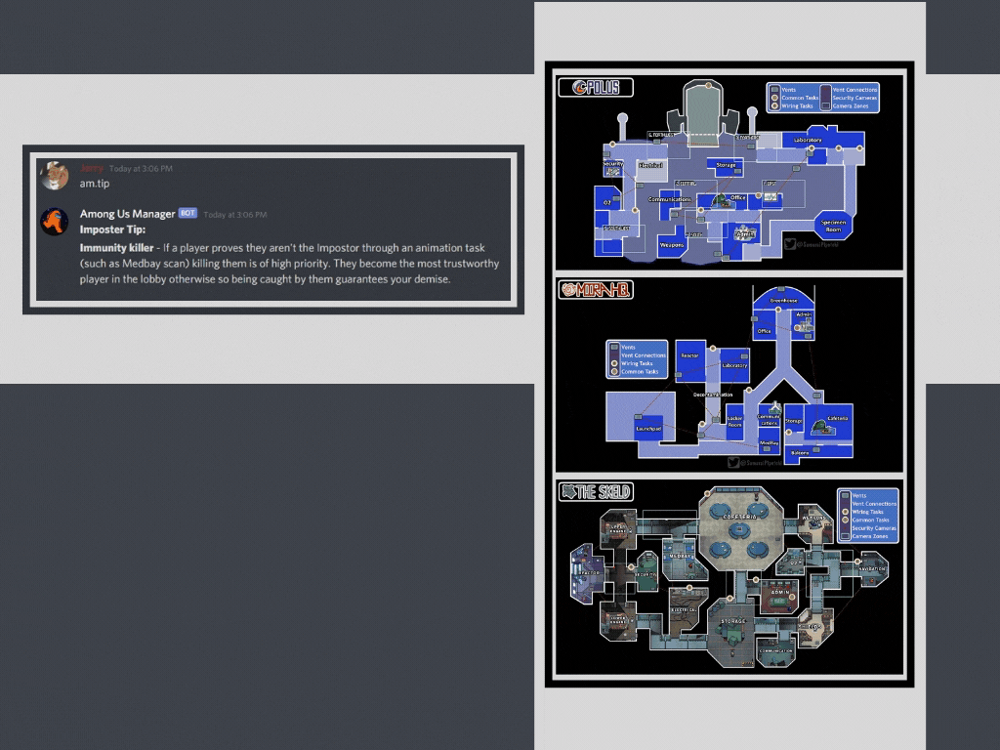

<h1>Among Us Manager</h1>  

Among Us Manager is the only discord bot you need to smoothly control the muting straight from inside Discord, with tons of extra quality of life features!

&nbsp;

# Features

## Interface

## Reactions

## Spectate

## Wiki

## Commands
Start Command | Starting description
--------|---------
`am.start` | Host new game a in current voice channel. Only one game is allowed in each voice channel
`am.join` | Joins existing game in voice channel
`am.joinall` | Force joins everyone in the voice channel into the game
`am.endgame` | Terminates existing game in voice channel. Only players in the game are able to use this command during a 6 hour time period after game is created
**Host Game Commands** | **Host description**
`am.round or 🔇` | Start the round (do tasks). Deafens everyone alive, unmutes everyone dead
`am.meeting or 📢` | Call a meeting. Undeafens everyone alive, mutes everyone dead.
`am.lobby or ⏮` | End of game, back to lobby. Undeafens and unmutes everyone
**Player Commands** | **Round description**
`am.dead or ☠` | Toggle status to dead. Undeafens during rounds to discuss with other dead players and hear other players alive
**Management Commands** | **Management description**
`am.promote <@user>` | Promotes player to host  **Host only**
`am.kick <@user>` | Removes player from game
`am.leave` | Leave game
**Wiki Commands** | **Wiki description**
`am.wiki` | link to the official Among Us Fandom Wiki.
`am.map <map>` | image of map with vents, common tasks, and more
`am.tip <imposter OR crewmate>` | returns random tip for either the imposter or crewmate.
