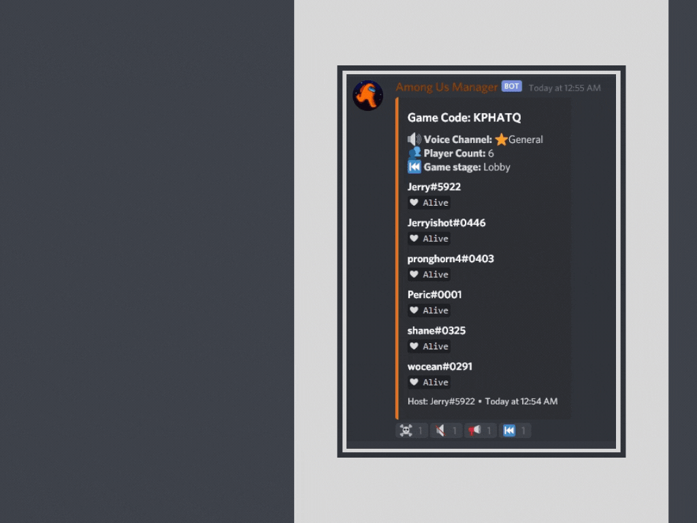
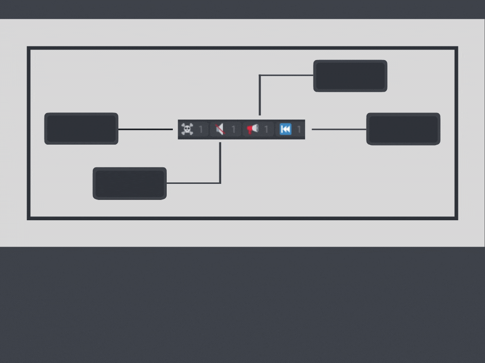

 


<!-- PROJECT LOGO -->
<br />
<p align="center">
  <a href="https://github.com/jerryluoaustin/Among-Us-Manager">
    
  </a>


  <h2 align="center">among us manager</h2>

  <p align="center">
    Simple among us discord bot
    <br />
    <a href="https://github.com/jerryluoaustin/Among-Us-Manager/blob/master/demos/slide3.gif">View Demo</a>
    ·
    <a href="https://github.com/jerryluoaustin/Among-Us-Manager/issues">Report Bug</a>
    ·
    <a href="https://github.com/jerryluoaustin/Among-Us-Manager/issues">Request Feature</a>
  </p>
  <p align="center">
  <a href="https://discord.com/oauth2/authorize?client_id=756743033181044827&permissions=12787776&scope=bot">
    
  </a>
</p>


<!-- TABLE OF CONTENTS -->
<details open="open">
  <summary><h2 style="display: inline-block">Table of Contents</h2></summary>
  <ol>
    <li>
      <a href="#about-the-project">About The Project</a>
      <ul>
        <li><a href="#built-with">Built With</a></li>
      </ul>
    </li>
    <li><a href="#getting-started">Getting Started</a></li>
    <li><a href="#commands">Commands</a></li>
    <li>
      <a href="#development">Development</a>
      <ul>
        <li><a href="#prerequisites">Prerequisites</a></li>
        <li><a href="#installation">Installation</a></li>
      </ul>
    </li>
    <li><a href="#usage">Usage</a></li>
    <li><a href="#roadmap">Roadmap</a></li>
    <li><a href="#contributing">Contributing</a></li>
    <li><a href="#license">License</a></li>
    <li><a href="#contact">Contact</a></li>
  </ol>
</details>


<!-- ABOUT THE PROJECT -->
## About The Project

Among Us Manager is a feature rich discord bot to smoothly manage Among Us muting from inside Discord. It uses an interface to display games, with the option to use reactions or host personal muting to control. No downloads are necessary to use, just press the [invite link](https://discord.com/oauth2/authorize?client_id=756743033181044827&permissions=12787776&scope=bot) and add it to your server.

### Built With

* [discord.py](https://github.com/Rapptz/discord.py)

<!-- GETTING STARTED -->
## Getting Started

Press the [invite link](https://discord.com/oauth2/authorize?client_id=756743033181044827&permissions=12787776&scope=bot) to add the bot your Discord server. However, to run your own instance of the bot follow these simple steps. First click to deploy to Heroku using the button below.

[](https://heroku.com/deploy?template=https://github.com/jerryluoaustin/Among-Us-Manager)

Create a [bot token](https://github.com/reactiflux/discord-irc/wiki/Creating-a-discord-bot-&-getting-a-token). Then go to the settings tab of the heroku app, scroll down to config vars, reveal them, type `KEY` in the left box and `BOT TOKEN` (the one you just created) in the right box.

## Commands
Start Commands | Description:
--------|---------
`am.start <code>` | Host new game in current voice channel. Only one game is allowed in each voice channel *Code optional*
`am.join` | Joins existing game in voice channel
`am.joinall` | Force joins everyone in the voice channel into the game
`am.endgame` | Terminates existing game in voice channel. Only players in the game are able to use this command during a 6 hour time period after game is created
**Host Game Commands** |
`am.round or 🔇` | Mute everyone alive (tasks)
`am.meeting or 📢` | Unmute everyone alive (meeting)
`am.lobby or ⏮` | Restart game (lobby). Sets everyone alive and unmutes all
**Player Commands** |
`am.dead or ☠` | Toggle status to dead: lets you hear everyone during rounds
**Settings Commands** |
`am.settings` | Display settings
`am.settings deafen / mute / move` | Choose to deafen or mute or move channels during rounds
`am.settings show / hide` | Choose to show player vitals or only player list
`am.settings reactions / host` | Choose to control muting using reactions or host self muting
**Management Commands** |
`am.promote <@user>` | Promotes player to host
`am.kick <@user>` | Removes player from game
`am.leave` | Leave the game
`am.code <code>` | Change the code displayed on the interface
**Wiki Commands** |
`am.wiki` | Link to the official Among Us Fandom Wiki
`am.map <map>` | Image of map with vents, common tasks, and more
`am.controls` | Image of default keybinds
`am.tip <imposter OR crewmate>` | Returns random tip for either the imposter or crewmate

<!-- USAGE EXAMPLES -->
## Usage




## Development

### Prerequisites

* Python ≥ 3.6

### Installation

1. Clone the repo
   ```sh
   git clone https://github.com/jerryluoaustin/Among-Us-Manager.git
   ```
2. Install pip packages
   ```sh
   pip install -r requirements.txt
   ```

<!-- ROADMAP -->
## Roadmap

See the [open issues](https://github.com/github_username/repo_name/issues) for a list of proposed features (and known issues).


<!-- CONTRIBUTING -->
## Contributing

1. Fork the Project
2. Create your Feature Branch (`git checkout -b feature/AmazingFeature`)
3. Commit your Changes (`git commit -m 'Add some AmazingFeature'`)
4. Push to the Branch (`git push origin feature/AmazingFeature`)
5. Open a Pull Request

<!-- LICENSE -->
## License

Distributed under the GNU General Public License v3.0. See `LICENSE` for more information.


<!-- CONTACT -->
## Contact

Jerry Luo - Jerry#5922

Project Link: [https://github.com/jerryluoaustin/Among-Us-Manager](https://github.com/jerryluoaustin/Among-Us-Manager)
